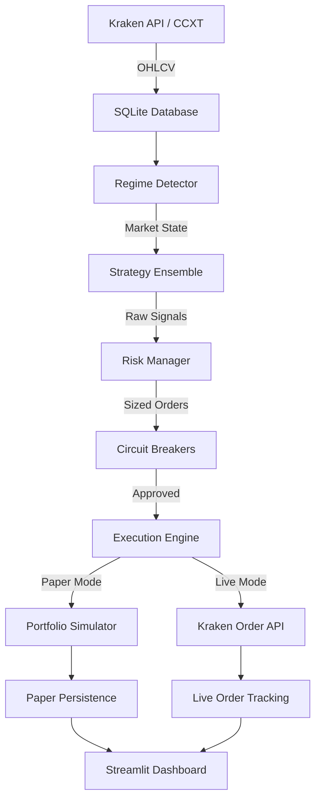

# Architecture

## System Overview

HOT-Crypto is a modular algo trading engine designed for cryptocurrency markets on Kraken. The system follows a pipeline architecture where market data flows through detection, signal generation, risk filtering, and execution stages.

## Data Flow

## Core Modules

### Regime Detector (`core/regime_detector.py`)

Classifies the current market into one of four regimes:

| Regime | Hurst | ADX | Recommended Strategies |
|--------|-------|-----|----------------------|
| `TRENDING_STRONG` | > 0.6 | > 25 | Trend EMA, SuperTrend, Turtle |
| `TRENDING_WEAK` | > 0.6 | ≤ 25 | Squeeze Breakout, Triple Momentum |
| `MEAN_REVERTING` | < 0.4 | any | Mean Reversion BB, Volatility Hunter |
| `RANDOM_WALK` | 0.4–0.6 | any | Grid Ladder (reduced size) |

**Hurst Exponent**: Measures persistence in price series. H > 0.5 = trending, H < 0.5 = mean-reverting.

**ADX (Average Directional Index)**: Measures trend strength regardless of direction. ADX > 25 = strong trend.

### Ensemble (`core/ensemble.py`)

Aggregates signals from multiple strategies using:
1. **2-of-3 consensus rule** — requires majority agreement
2. **Regime-weighted voting** — strategies matching the current regime get higher weight
3. **Conflict resolution** — opposing BUY/SELL signals default to HOLD unless overwhelming majority

### Risk Manager (`core/risk_manager.py`)

Three-layer position sizing:

1. **Half-Kelly Criterion**: `f* = 0.5 × (p × b − q) / b` where p = win rate, b = avg win/loss ratio, q = 1−p
2. **Volatility Targeting**: Scale position to achieve 15% annualized volatility
3. **Correlation Guard**: Reduce position by `(1 − avg_correlation)` when multiple assets are held

Additional checks: daily loss limit (2%), max drawdown (10%), max positions (2), cooldown after losses.

### Circuit Breakers (`core/circuit_breaker.py`)

| Breaker | Trigger | Lockout |
|---------|---------|---------|
| **Asset-Level** | Single asset drops > 15% | 4 hours per asset |
| **Portfolio Kill Switch** | Total equity drops > 10% | 24 hours, all trading |
| **Consecutive Loss** | 3+ consecutive losses | 4 hours |
| **Flash Crash** | Any asset drops > 20% in one bar | 4 hours |

### Execution Engine (`core/execution.py`)

- **Idempotent orders** via `clientOrderId` generation
- **Order state machine**: PENDING → SUBMITTED → FILLED / CANCELLED / FAILED
- **Order reconciliation** for crash recovery
- **Paper mode**: simulated fills with slippage modeling
- **Live mode**: real order creation via CCXT with rate limiting

### Rate Limiter (`core/rate_limiter.py`)

Thread-safe token-bucket rate limiter configured for Kraken's limits:
- 900 requests/minute (15/sec) for private endpoints
- 90% safety margin to prevent 429 errors

### Exchange Client (`core/exchange_client.py`)

CCXT wrapper providing:
- OHLCV data fetching with pagination
- Balance and position queries
- Order creation with minimum order size validation
- Market metadata caching

## Database Schema

| Table | Purpose |
|-------|---------|
| `ohlcv` | OHLCV candle data (exchange, symbol, timeframe, OHLCV) |
| `backtest_runs` | Backtest session metadata and performance stats |
| `backtest_trades` | Individual trade records from backtests |
| `paper_runs` | Paper trading session tracking |
| `paper_events` | Event log for paper sessions |
| `paper_trades` | Simulated trade executions |
| `live_orders` | Live order tracking with state machine |
| `circuit_breaker_state` | Persistent breaker state across restarts |
| `tax_ledger` | Tax lot tracking for compliance |

## Exchange: Kraken

### Why Kraken
- Supports business/LLC accounts (IRA-LLC compatible)
- Native USD pairs (no stablecoin risk)
- Lower fees than Binance.US (maker: 0.16%, taker: 0.26%)
- Strong US regulatory standing
- Reliable API with good rate limits

### API Configuration
- Public endpoints: market data, OHLCV (no auth needed)
- Private endpoints: balances, orders (API key + secret)
- Rate limits enforced via token-bucket limiter
